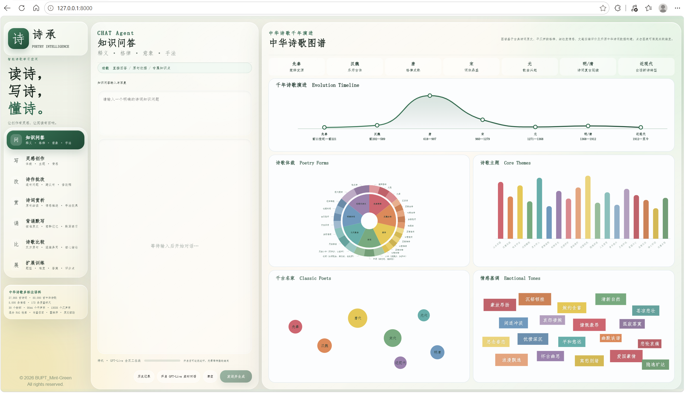
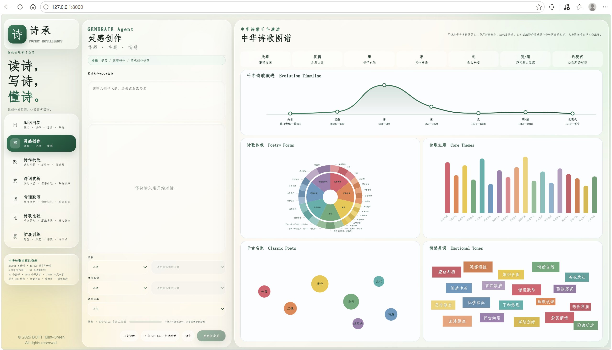
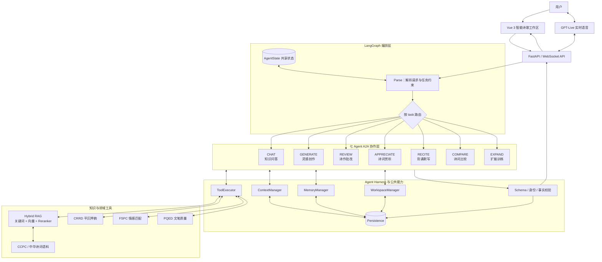
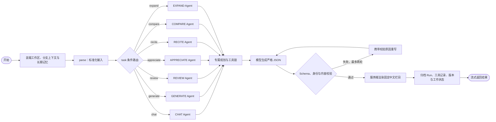
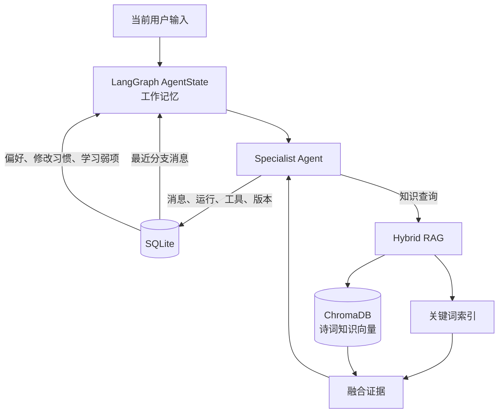
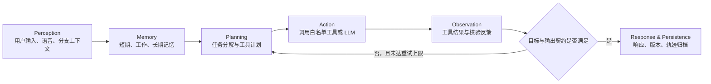
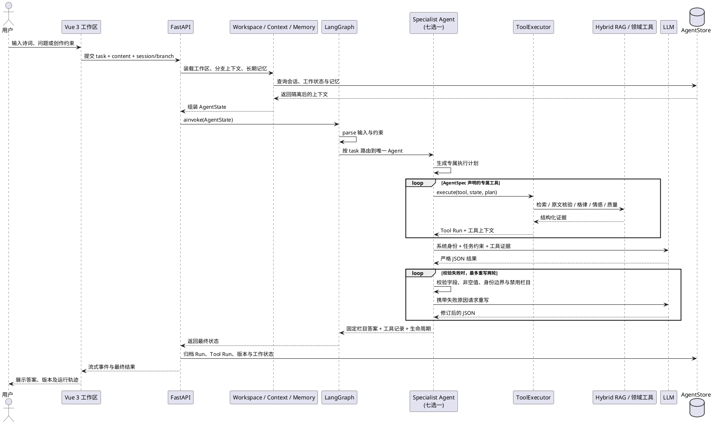

# Poetry Intelligence: An Intelligent Space for Learning Chinese Poetry

[English](#english-version) · [中文](#中文版本)

<a id="english-version"></a>

## English Version


**Poetry Intelligence** is a multi-agent system for learning, creating, appreciating, reciting, comparing, and teaching classical and modern Chinese poetry. Built with LangGraph, it orchestrates seven isolated specialist agents and combines poetry texts, tonal and rhyme patterns, fine-grained emotion annotations, and writing-quality data into a traceable, verifiable, continuously editable poetry workspace.

### Highlights

- **GPT-Live-style voice interaction**: A full-duplex WebSocket channel combines voice activity detection, Chinese poetry ASR, incremental transcription, streaming text generation, and audio playback. Natural pauses can submit a turn, users can interrupt spoken responses, and the system falls back to browser transcription and a compatible streaming model when the realtime channel is unavailable.
- **Engineering-grade Agent Harness**: `ToolExecutor`, `WorkspaceManager`, `ContextManager`, `MemoryManager`, and the persistence layer provide controlled tool use, isolated branches, layered memory, lifecycle tracking, and auditable Run and Tool Run records.
- **LangGraph multi-agent orchestration**: Typed state, explicit task routing, specialist tool permissions, structured output validation, self-checking, and automatic rewriting prevent identity, format, and task-boundary violations.
- **Hybrid RAG for poetry**: Keyword retrieval, vector search, fusion ranking, optional reranking, and source verification reduce author, title, and quotation mismatches. Evidence is drawn from CCPC, CRRD, FSPC, PQED, and open Chinese poetry resources.

### Seven Specialist Agents

| Agent | Capability | Output contract |
| --- | --- | --- |
| CHAT | Poetry Q&A, biographies, word explanations, prosody, and literary techniques | Direct answer / textual evidence / key knowledge |
| GENERATE | Original poetry under genre, form, subject, and emotion constraints | Title / complete poem / creation notes |
| REVIEW | Prosody and genre checking with line-by-line revision suggestions | Form check / line-by-line review / revised poem / revision notes |
| APPRECIATE | Close reading of imagery, diction, structure, emotion, and technique | Poetic atmosphere / close reading / emotional progression / effects |
| RECITE | Verified source text plus memorization and dictation exercises | Poem information / accurate text / memory groups / exercises / answers |
| COMPARE | Evidence-based, two-way comparison of two poems | Objects / dimension-by-dimension comparison / key similarities and differences |
| EXPAND | Layered exercises around a poem, concept, or learning weakness | Instructions / questions / answers / scoring points |

Each agent has its own identity, tool allowlist, input semantics, output schema, and forbidden sections. The model returns strict JSON first; the backend validates fields, content, evidence, identity boundaries, and task scope before rendering fixed sections. Invalid results are automatically rewritten, while generation-specific recovery prevents titles, poems, and creation notes from becoming misaligned.

### Interface

The Vue 3 workspace contains a left navigation panel for the seven agents, a central streaming interaction area, and a right-side interactive Chinese poetry knowledge graph. The central workspace supports text and realtime voice input, conversation history, versions, branches, and visual reports for prosody, emotion, and writing quality. The knowledge graph presents seven historical periods and cards for genres, themes, notable poets, and emotional tones.

### Architecture

The production graph uses typed `AgentState`, input parsing, seven-way conditional routing, and `END`. Planning, tool use, observations, JSON validation, and rewrite loops are encapsulated in `SpecialistAgent.run()`. This is therefore most accurately described as a **LangGraph-supervised multi-agent system**, rather than a system in which every reasoning step is split into a LangGraph subgraph.

The system uses SQLite and ChromaDB for different purposes:

- **SQLite** stores sessions, messages, branches, work states, memories, runs, tool runs, and poem versions.
- **ChromaDB** stores only poetry knowledge embeddings for semantic RAG retrieval; it is not the user’s long-term memory store.
- **Short-term memory** consists of recent messages in the current branch.
- **Working memory** is the current LangGraph `AgentState`.
- **Long-term memory** contains structured user preferences, revision habits, and learning weaknesses, recalled by session and task.

The Agent Harness provides controlled tools for retrieval, source verification, prosody, emotion, quality assessment, versioning, and weakness memory. All important lifecycle stages—planning, action, tool execution, validation, revision, memory, and persistence—can be recorded for demonstration and review.

### Project Structure

```text
poetry-agent/
├─ backend/              # FastAPI service, LangGraph, agents, tools, retrieval, persistence
├─ frontend/web/         # Vue 3 + TypeScript source
├─ frontend/dist/        # Vite production build served by FastAPI
├─ a_datasets/           # Poetry, prosody, emotion, and quality datasets
├─ storage/chroma/       # ChromaDB poetry knowledge index
├─ evolving_logs.db      # SQLite sessions, memories, traces, branches, and versions
├─ requirements.txt      # Python dependencies
└─ run.bat               # Windows one-click launcher
```

### Technology Stack

| Area | Technologies |
| --- | --- |
| Frontend | Vue 3, TypeScript, Vite, vue-tsc, ECharts |
| Backend | FastAPI, Uvicorn, Pydantic, asyncio, WebSocket |
| Agent orchestration | LangGraph, typed `AgentState`, specialist routing |
| LLM access | OpenAI-compatible Python SDK and streaming APIs |
| Retrieval | ChromaDB, Sentence Transformers, BGE, jieba |
| Persistence | SQLite |
| Data processing | NumPy and local dataset loaders |
| Realtime voice | GPT-Live-style WebSocket bridge with VAD, ASR, transcription, playback, and interruption |

Alibaba Cloud models are accessed through the OpenAI-compatible protocol, so configuration uses `OPENAI_API_KEY`, `OPENAI_BASE_URL`, and `OPENAI_MODEL`. This does not require the official OpenAI service.

### Running the Project

#### 1. Install backend dependencies

```powershell
cd poetry-agent
python -m pip install -r requirements.txt
Copy-Item .env.example .env
```

Configure the compatible model endpoint, API key, and model name in `.env`. Without an external model, local retrieval and heuristic analysis remain available.

#### 2. Build the frontend

```powershell
cd frontend\web
npm install
npm run build
cd ..\..
```

The build output is written to `frontend/dist` and served by FastAPI.

#### 3. Start on Windows

Double-click `run.bat`, or start the service manually:

```powershell
python -m uvicorn backend.main:app --reload
```

The launcher uses its own directory as the project root, selects an available Python environment, installs missing dependencies, builds missing frontend assets, starts FastAPI, and opens `http://127.0.0.1:8000`.

### Reliability and Isolation

- Every agent has an independent JSON schema and section signature.
- The current request takes priority over stale poem text or constraints.
- Genre, form, subject, and emotion selectors are passed only to `GENERATE`.
- Branch history and creation parameters are isolated to prevent cross-agent contamination.
- Factual answers require source text or retrieval evidence where applicable.
- Conflicting source, author, or title information is marked as uncertain.
- Failed validation triggers bounded rewriting; empty sections, duplicate headings, and placeholder answers are rejected.
- Poetry text, prosody, emotion, quality, tool results, runs, versions, and workspace state can be archived for auditing.

> The system does not record or display hidden chain-of-thought. Stored plans contain executable steps and constraints only; observations contain summarized tool results and validation feedback.

### Chinese Version


<a id="中文版本"></a>

# 诗承：智能诗歌学习空间

“诗承”是面向古今诗词学习、创作与教学训练的多 Agent 系统。项目以 LangGraph 编排七个职责隔离的专业 Agent，结合诗词原文、平仄押韵、细粒度情感和文笔质量数据，为用户提供可追溯、可校验、可持续编辑的诗歌学习工作空间。

## 技术亮点

### GPT-Live 实时语音交互

系统接入 GPT-Live 风格的实时全双工通道，将语音活动检测、中文诗词 ASR、增量转写、流式文本生成和音频播放组织为同一会话。服务端 VAD 支持自然停顿提交，用户说话时可打断正在播放的回答；诗人、篇名、词牌和古诗原句通过领域 Prompt 提升识别准确率。实时通道异常时自动保留录音并回退到浏览器转写与兼容流式模型，避免整轮交互丢失。

### Agent Harness 工程化运行时

项目不是简单的 Prompt 路由，而是包含完整 Agent Harness：

- `ToolExecutor` 统一注册、调用并记录检索、格律、情感、质量和版本工具；
- `WorkspaceManager` 为会话建立工作区与任务分支；
- `ContextManager` 注入当前分支状态，隔离其他 Agent 的词牌、题材和回答；
- `MemoryManager` 召回长期偏好并提取当前任务记忆；
- Persistence 层归档 Run、Tool Run、版本、分支轨迹和工作状态；
- 生命周期记录 Planning、Action、Validation、Revision、Memory 等阶段，便于演示与复盘。

### LangGraph 多 Agent 编排

LangGraph 将意图解析、并行检索、相关性评分、查询改写、分析、专业 Agent 路由、自省校验和自动修订组成有状态图。七个 Specialist Agent 分别拥有独立的系统身份、工具集合、输出 Schema 和禁止栏目；模型输出需通过结构、事实相关性、原文引用和任务边界校验，不合格结果会自动重写。

### Hybrid RAG 诗词知识增强

RAG 层融合关键词检索、向量语义检索和重排序，并通过原文核验器减少作者、题名与诗句错配。检索上下文来自 CCPC 古典诗词原文、CRRD 平仄押韵、FSPC 细粒度情感、PQED 文笔质量及开源中华诗词数据。工具证据只服务于当前问题，不允许用低相关检索结果填充回答；原文冲突时明确标注版本或不确定性。

## 核心能力

系统提供七个相互隔离的专业 Agent。每个 Agent 使用独立输入语义、工具链和固定输出契约，避免创作词牌、情感条件或历史回答串入其他任务。

| Agent | 功能 | 固定回答结构 |
| --- | --- | --- |
| CHAT Agent | 诗词知识问答、作者生平、字词释义、格律与手法解释 | 直接回答 / 原句依据 / 专属知识点 |
| GENERATE Agent | 按体裁、词牌、题材和情感约束原创诗词 | 题目 / 完整诗作 / 创作说明 |
| REVIEW Agent | 检查体裁格律并逐句提出可操作修改 | 体裁检查 / 逐句批改 / 完整修改稿 / 修改说明 |
| APPRECIATE Agent | 围绕原句进行意象、炼字、结构和情感细读 | 诗境概括 / 原句细读 / 情感推进 / 手法效果 |
| RECITE Agent | 核准篇目原文并生成记忆与默写练习 | 篇目信息 / 准确原文 / 意群记忆 / 背诵默写 / 参考答案 |
| COMPARE Agent | 对两首诗词进行逐维、双向引用的比较 | 比较对象 / 逐维对照 / 核心异同 |
| EXPAND Agent | 围绕当前诗词或知识点生成分层训练 | 训练说明 / 题目 / 参考答案 / 评分要点 |

模型首先返回严格 JSON，后端校验字段集合、非空内容、栏目串扰和“暂无”等无效占位；失败时自动重写，最终由服务端统一渲染中文编号栏目。创作 Agent 另有文本恢复逻辑，防止题目、诗作和创作说明错位。

## UI 布局

### 顶部品牌区

左上角显示“诗承 / POETRY INTELLIGENCE”品牌标识。界面中文和主要英文标题采用仿宋字体体系，整体保持古典书卷气与现代玻璃拟态质感。

### 左侧功能导航

左栏包含品牌介绍、“智能诗歌学习空间”标语和七个 Agent 入口。切换 Agent 时会切换输入提示、功能契约和分支工作区；离开灵感创作后会清理体裁、词牌、题材与情感筛选状态，避免跨 Agent 串扰。

### 中央 Agent 工作区

中央区域由以下部分组成：

- Agent 中英文标题、职责徽标和输出契约；
- 输入区与流式回答区；
- 灵感创作专属的两级体裁、词牌、情感和题材选择器；
- 实时语音转写、发送、停止和状态提示；
- 历史会话、版本与分支工作区；
- 批改报告中的格律、情感和文笔质量可视化。

灵感创作支持先秦楚辞、汉魏古体、唐诗、宋词、元代散曲、明清诗词和近现代诗文，并进一步细分绝句、律诗、歌行、常见词牌和曲牌。

### 右侧中华诗歌图谱

右侧不是搜索框，而是可交互的静态知识图谱。顶部“千年诗歌演进”保留先秦、汉魏、唐代、宋代、元代、明清和近现代七个阶段；悬停可查看时代范围、文学发展、核心体裁、代表作家作品与审美特征。

下方四张 Card 分别展示：

1. **诗歌体裁**：双层饼图。内圈为时代体裁大类，外圈为具体诗体、词牌和曲牌；悬停细分类可查看体式特点、代表作者及作品示例。
2. **诗歌主题**：展示山水田园、边塞征战、咏史怀古、送别、思乡等主题分布及代表篇目。
3. **千古名家**：按时代展示代表诗人节点，支持悬停查看人物简介和点击展开同代诗人。
4. **情感基调**：展示豪放昂扬、沉郁顿挫、婉约含蓄、清新自然等细粒度情感及代表诗人与作品。

图表按梅红、暖橙、柠檬黄、薄荷绿、天青、月白蓝、薰衣草紫的彩虹顺序配色。饼图父类使用较浅纯色，子类使用同色系中等色与深色；其余图表使用中等深度纯色，不使用色块内部渐变。

## 项目框架与目录

项目采用前后端分离开发、FastAPI 一体化部署的结构。后端负责 Agent 编排、模型访问、检索、领域工具和持久化；前端构建产物位于 `frontend/dist`，生产运行时由 FastAPI 直接提供静态资源。

```text
poetry-agent/
├─ backend/
│  ├─ agents/                 # 七个 Agent 的 Profile、状态、执行闭环与注册表
│  │  ├─ poetry_agent.py      # 应用门面：装载资源、运行 LangGraph、归档结果
│  │  ├─ specialist_agent.py  # Planning、Tool Use、Observation、生成与校验
│  │  └─ state.py             # LangGraph AgentState 工作记忆
│  ├─ graph/                  # LangGraph 生产工作流
│  ├─ harness/                # Context、Memory、Workspace、ToolExecutor
│  ├─ retrieval/              # 关键词检索、Chroma 向量检索与融合
│  ├─ tools/                  # 平仄、情感、质量等领域工具
│  ├─ persistence/            # SQLite 会话、记忆、运行、分支和版本存储
│  ├─ realtime/               # GPT-Live 风格实时语音桥接
│  ├─ main.py                 # FastAPI REST、WebSocket 和静态资源入口
│  ├─ config.py               # 模型、数据、存储和实时通道配置
│  └─ data_loader.py          # CCPC、CRRD、FSPC、PQED 等数据加载
├─ frontend/
│  ├─ web/src/                # Vue 3 + TypeScript 源码
│  └─ dist/                   # Vite 生产构建产物
├─ a_datasets/                # 诗词原文、格律、情感和质量数据
├─ storage/chroma/            # 诗词知识向量索引，不存用户长期记忆
├─ evolving_logs.db           # SQLite：历史、记忆、轨迹、分支和作品版本
├─ requirements.txt           # Python 依赖
└─ run.bat                    # Windows 一键启动
```

### 技术栈

| 分类 | 技术 | 项目用途 |
| --- | --- | --- |
| 前端框架 | Vue 3、TypeScript | 七 Agent 工作区、状态管理和交互界面 |
| 构建与类型检查 | Vite、vue-tsc | 前端开发、类型检查和生产构建 |
| 可视化 | ECharts | 诗歌体裁、主题、名家和情感图谱 |
| Web 服务 | FastAPI、Uvicorn、Pydantic | REST API、请求 Schema、静态资源服务和生命周期管理 |
| 双向流式通信 | WebSocket、asyncio | Agent 节点事件、Token 流、取消任务和实时语音 |
| Agent 编排 | LangGraph | `AgentState` 状态传递、入口节点、七 Agent 条件路由与退出 |
| LLM 接入 | OpenAI Python SDK 兼容接口 | 接入阿里云 OpenAI 兼容 API，完成专业生成和 JSON 输出 |
| 向量数据库 | ChromaDB | 仅存储诗词知识 Embedding，用于 RAG 语义检索 |
| Embedding / Reranker | Sentence Transformers、BGE | 中文诗词向量化和本地可选重排序 |
| 关键词处理 | jieba | 中文分词和关键词召回 |
| 业务数据库 | SQLite | 历史消息、长期记忆、运行轨迹、反馈、分支与作品版本 |
| 数据处理 | NumPy、本地 Loader | 数据集加载、评分和统计 |
| 实时语音 | GPT-Live 风格 WebSocket Bridge | VAD、ASR、增量转写、音频播放和打断 |

> 阿里云模型通过 OpenAI 兼容协议接入，因此配置项沿用 `OPENAI_API_KEY`、`OPENAI_BASE_URL` 和 `OPENAI_MODEL` 名称；这不表示项目必须调用 OpenAI 官方服务。

## 技术架构

| 层级 | 技术与职责 |
| --- | --- |
| Web UI | Vue 3、TypeScript、Vite、ECharts；七 Agent 工作区、流式回答与交互图谱 |
| GPT-Live | WebSocket 全双工会话、实时 ASR、VAD、增量 transcript、音频队列与自然打断 |
| Agent Graph | LangGraph 状态图；解析、检索、评分、改写、路由、校验、修订与归档 |
| Agent Harness | ToolExecutor、WorkspaceManager、ContextManager、MemoryManager 与生命周期追踪 |
| Hybrid RAG | 关键词检索、向量检索、融合排序、Reranker、原文与作者题名核验 |
| Domain Tools | 平仄押韵检查、FSPC 情感匹配、PQED 文笔评分、版本写入与弱项记忆 |
| Persistence | 会话、Run、工具调用、分支、工作状态、作品版本和长期记忆 |
| Data | CCPC、CRRD、FSPC、PQED 及开源中华诗词数据 |
| API | FastAPI、OpenAI 兼容异步流式客户端与静态前端服务 |

### 项目总体架构图

下面的 Mermaid 图从交互层、服务层、编排层、专业 Agent 层、能力层和数据层展示系统结构。七个 Agent 并不是七套彼此孤立的接口，而是在 LangGraph 统一调度下，共享经过边界控制的状态、工具、记忆和持久化能力。



### LangGraph 七 Agent 流程图

LangGraph 使用 `AgentState` 承载当前任务、用户输入、分支上下文、长期记忆和工作区信息。请求先经过 `parse` 节点，再依据前端明确传入的 `task` 条件路由到唯一 Specialist Agent；Agent 在内部完成规划、工具调用、模型生成、结构校验与必要重写，随后将结果和运行轨迹归档。显式任务路由避免重复意图识别，也能阻止不同 Agent 的输出栏目和创作条件互相串扰。

当前生产图的 LangGraph 使用范围是“类型化状态 + parse + 七路条件路由 + END”。Planning、Tool Use、Observation 和 JSON 修订循环封装在 `SpecialistAgent.run()` 中，而不是拆成独立图节点。`poetry_agent.py` 中的 `_build_legacy_graph()` 保留了检索评分与修订图实验，但当前运行入口没有启用它。因此，本项目准确的表述是“LangGraph 监管路由的多 Agent 系统”，而不是“所有 Agent 推理步骤都已拆成 LangGraph 子图”。



### 多智能体 A2A 协作机制

本项目采用的是**由 LangGraph 监管编排的应用层 A2A（Agent-to-Agent）协作模式**：七个专业 Agent 通过统一状态、工作区、工具调用记录和持久化结果交换任务信息，而不是让多个角色在同一个 Prompt 中自由对话。当前实现属于中心化、可审计的 A2A 编排；这里的“A2A”描述多智能体间的协同设计，不特指某个外部厂商的网络通信协议。

A2A 协作主要体现在：

1. **统一任务信封**：`AgentState` 携带 `task`、输入正文、体裁、题材、情感、会话和分支标识，使 Agent 接收一致且可追踪的任务上下文。
2. **能力声明与精准路由**：每个 Agent 通过 `AgentSpec` 声明身份、专属工具和输出 Schema，LangGraph 根据 `task` 将任务交给唯一有权处理的 Agent。
3. **共享能力而非共享噪声**：Agent 可复用检索、原文核验、格律、情感、质量、版本和弱项记忆工具；`ContextManager` 与分支工作区只注入本任务允许读取的信息。
4. **结构化结果交接**：专业 Agent 先返回严格 JSON，校验通过后再渲染为固定栏目。后续任务可通过工作状态、作品版本和长期记忆消费已归档结果，形成可恢复的 Agent 间交接链路。
5. **全链路可审计**：Planning、Action、Tool Run、Validation、Revision、Memory 和最终版本均可记录，便于定位某一结论由哪个 Agent、哪次工具调用和哪份数据产生。
6. **身份与安全边界**：每个 Agent 都有禁止栏目和内容边界；非创作 Agent 不接收创作筛选条件，其他分支的历史和正文不会被直接拼入当前回答。

七个 Agent 的协作关系可以概括为“各司其职、按需交接”：CHAT 提供知识依据，GENERATE 产出作品版本，REVIEW 基于作品进行诊断和修订，APPRECIATE 进行文本细读，RECITE 将核准原文转化为记忆训练，COMPARE 组织双文本证据，EXPAND 则把诗词和学习弱项转化为分层练习。它们共享底层能力，但始终保持各自身份、工具权限和输出契约。

### 数据库、向量库与三层记忆

项目同时使用 SQLite 和 ChromaDB，但二者职责不同，不能将“使用了向量 RAG”表述成“长期记忆已经向量化”。

| 数据类型 | 存储位置 | 召回方式 | 是否向量化 |
| --- | --- | --- | --- |
| 当前请求与中间状态 | LangGraph `AgentState` | 当前 Run 内状态传递 | 否 |
| 当前分支历史消息 | SQLite `messages` | `session_id + branch_id`，按时间截取最近消息 | 否 |
| 用户偏好、修改习惯、学习弱项 | SQLite `memories` | `session_id + task + confidence + active` 精确过滤 | 否 |
| Agent 运行记录 | SQLite `runs` | Run ID 和会话查询 | 否 |
| 工具执行轨迹 | SQLite `tool_runs` | Run 或 branch 查询 | 否 |
| 会话与任务分支 | SQLite `conversations`、`branches` | 会话和父子分支关系查询 | 否 |
| 当前工作状态 | SQLite `work_states` | branch 精确查询 | 否 |
| 诗作及修改版本 | SQLite `artifacts`、`artifact_versions` | 会话、任务和分支查询 | 否 |
| 诗词知识语料 | ChromaDB `poetry` Collection | Embedding Top-K 语义相似度 | 是 |
| 关键词知识索引 | 内存检索器 | 分词、字段过滤与关键词评分 | 否 |

三层记忆的边界如下：

- **短期记忆**：当前分支最近对话，由 `ContextManager` 从 SQLite 装载；
- **工作记忆**：当前 LangGraph Run 中的 `AgentState`，包含输入、计划、工具上下文、Observation、Action 和最终结果；
- **长期记忆**：`MemoryManager` 从“我喜欢”“请保留”“我不擅长”等表达中提取 preference、revision 和 weakness，保存在 SQLite 并按任务召回。



当前长期记忆采用结构化数据库的原因是明确偏好和禁止项需要稳定、精确召回。例如“不要使用空泛总结”不应因向量相似度不足而遗漏。后续可以在保留 SQLite 权威记录的基础上增加记忆 Embedding，形成“结构化过滤 + 语义 Top-K + 时间/置信度重排”的 Hybrid Memory。

### Agent 标准组件对照

一个完整的工程化 Agent 通常包含 Profile、Perception、Planning、Memory、Tools、Action、Observation 和 Orchestration 八项核心能力，并以 Observability 与 Guardrails 作为横切保障。本项目逐项对照如下：

| Agent 组件 | 项目实现 | 符合度与边界 |
| --- | --- | --- |
| LLM / 推理核心 | 通过 OpenAI 兼容异步客户端接入阿里云模型 API；各 Agent 使用独立 System Prompt、温度和结构化输出要求 | 已具备。外部模型负责语义理解与答案生成，本地启发式能力负责离线降级 |
| Profile / 角色定义 | `AgentSpec` 将 Agent 名称、身份 Prompt、工具白名单和 JSON Schema 封装为不可变能力卡 | 已具备。七个 Agent 的身份和禁止栏目相互隔离 |
| Perception / 感知 | FastAPI 接收文本、诗作、创作筛选和语音转写；`ContextManager` 将当前分支历史、工作状态和用户长期记忆装载到 `AgentState` | 已具备。这里的感知以数字输入和工具返回为主，不是机器人视觉、触觉等物理感知 |
| Planning / 规划 | 每个 Specialist Agent 依据任务生成可审计的 `plan`，拆分为定位对象、核验、分析、生成或训练等步骤 | 基础实现已具备，采用确定性 Plan-and-Solve。当前不是由 LLM 动态增删步骤的自主规划器，也不保存或展示隐式 CoT |
| Short-term Memory | 当前分支最近对话、`work_state` 和本次 `AgentState` | 已具备，并通过 branch 隔离不同任务上下文 |
| Working Memory | LangGraph `AgentState` 中的计划、工具上下文、Observations、Actions、答案与运行轨迹 | 已具备，只在当前 Run 内流转并选择性归档 |
| Long-term Memory | `MemoryManager` 从用户表达中提取 preference、revision、weakness，并由 `AgentStore` 持久化和按 session/task 召回 | 已具备基于 KV/数据库的长期记忆；目前不是向量语义记忆，召回主要按会话和任务过滤 |
| Tools / 工具使用 | 每个 `AgentSpec` 声明专属工具白名单，由 `ToolExecutor` 统一执行 Hybrid RAG、原文核验、格律、情感、质量、版本和弱项记忆工具 | 已具备受控 Tool Use。当前为应用层工具调度，不是 MCP Server，也未使用模型厂商原生 Function Calling 协议 |
| Action / 行动 | 执行工具、调用 LLM、生成严格 JSON、服务端渲染答案、写入版本与持久化运行状态 | 已具备。项目属于数字内容 Agent，行动对象是知识库、工作区和输出，不控制物理设备 |
| Observation / 观察反馈 | 每次工具输出被摘要为 Observation 并回注模型上下文；JSON 与身份校验失败原因会触发最多两轮重写 | 已具备工具反馈闭环。工具调用异常的统一恢复策略仍可继续增强 |
| Orchestration / 编排 | LangGraph 负责入口、状态传递、`task` 条件路由和结束；Harness 负责上下文、记忆、工作区与工具执行 | 已具备中心化编排。当前主图是“解析—单 Specialist—结束”，Agent 内部再完成计划、行动、观察和修订，不是七 Agent 自由自治会话 |
| Observability / 可观测性 | 归档 Run、Tool Run、生命周期、Trace、版本和工作状态，并通过事件流反馈节点状态 | 已具备基础追踪；若用于生产，可进一步接入 OpenTelemetry、LangSmith 或指标告警平台 |
| Guardrails / 安全护栏 | 工具白名单、Schema 校验、禁止栏目、身份隔离、原文核验、最大重写次数、API 超时与离线降级 | 已具备业务级护栏；仍应在生产环境补充限流、密钥托管、内容安全审核和提示注入检测 |

因此，本项目符合“感知—记忆—规划—工具—行动—观察反馈—编排”的完整 Agent 基本范式，也明显区别于一次性调用 LLM 的普通聊天应用。更准确的工程定位是：**LangGraph 监管的七 Specialist Agent 系统，采用确定性规划、受控工具调用、分层记忆和可审计执行闭环**。需要避免夸大的是，当前七个 Agent 由中心路由器选择并共享持久化工作区，尚不属于完全自治、点对点协商的开放式 Agent 网络。

#### 单次 Agent 执行闭环



> 说明：系统不会记录或展示模型的隐式思维链。`plan` 仅保存可执行步骤和约束，Observation 仅保存工具结果摘要与校验反馈，从而兼顾可审计性、隐私与模型安全。

### 基础 PlantUML 时序图

以下时序展示一次典型请求如何从用户界面进入 LangGraph，并由某个专业 Agent 调用工具、生成结果、校验和归档。将代码复制到支持 PlantUML 的 Markdown 插件或 PlantUML 渲染器即可生成图片。



## 运行方式

### 1. 安装后端依赖

```powershell
cd poetry-agent
python -m pip install -r requirements.txt
Copy-Item .env.example .env
```

在 `.env` 中配置兼容 OpenAI 协议的模型地址、密钥和模型名。未配置外部模型时，系统仍可使用本地检索和启发式分析能力。

### 2. 构建前端

```powershell
cd frontend\web
npm install
npm run build
cd ..\..
```

构建产物输出到 `frontend/dist`，由 FastAPI 提供静态页面。

### 3. 一键启动（Windows）

双击项目根目录的 `run.bat`。脚本始终以自身所在目录作为项目根目录，因此项目移动到任意磁盘、文件夹或其他 Windows PC 后仍使用相对路径运行。它会自动选择 `.venv`、`py -3` 或系统 `python`，在首次运行时安装缺少的依赖、构建缺少的前端产物、启动 FastAPI，并自动打开 `http://127.0.0.1:8000`。

也可手动启动：

```powershell
python -m uvicorn backend.main:app --reload
```

修改后端 Agent 或实时语音代码后需重启服务；前端缓存未更新时可使用 `Ctrl + F5` 强制刷新。

## 输出可靠性与任务隔离

- 七个 Agent 使用不同 JSON Schema 和栏目签名；
- 当前请求优先使用本轮输入，不以旧诗文覆盖新问题；
- 创作筛选参数只进入 GENERATE Agent；
- 非创作 Agent 不继承其他分支的词牌、情感和题材；
- 事实性回答要求原句或检索证据支持；
- 原文、作者和题名冲突时明确标注不确定性；
- 校验失败自动重写，禁止空栏目、重复一级标题和“暂无”占位；
- 诗词原文、格律、情感与质量工具的运行结果会随工作区归档。

## 版权

© 2026 Mint-Green. All rights reserved.
